# Apply via time awarded by the University of Bristol

<!--
SPDX-FileCopyrightText: © 2025 University of Bristol
SPDX-License-Identifier: CC-BY-SA-4.0
-->

Only members of staff of the University of Bristol can apply for time via these routes.

## Research use

You can apply for time via the [University of Bristol rolling call][uob-rolling-call]. This is a rolling call, with applications assessed and awarded within a month of submission.

Applications are for a fixed duration of 365 days, and you can apply to extend your project for a further 365 days during its last month if you need more time. Applications are also for default allocation of node hours on the BriCS services requested. You can apply for an additional allocation of node hours once you have consumed more than 90% of your default allocation. Full details of how accounting works on BriCS services are provided in the [BriCS accounting page][brics-accounting].

Currently, the values of the Default and Additional allocations on the different services are:

| Service       | Default allocation | Additional allocation |
|---------------|--------------------|-----------------------|
| Isambard-AI   | 1000 node hours    | 500 node hours        |
| Isambard 3    | 1000 node hours    | 500 node hours        |
| BlueCrystal 5 | 2000 node hours    | 1000 node hours       |

To complete your application, you will need to provide:

- A project name - this should be a short name that you will use to identify your project
- A project summary - this should be a brief (2-3 paragraph) summary of your project. This will be made visible to other users of BriCS services.
- A project description - this should be a short (3-4 paragraph) description of your project. This does not need to be a full proposal - just a brief description that will help the allocation committee understand what the time on BriCS services will be used for.
- You need to mark whether or not this project is non-commercial or research only. If your project is commercial, you should seek advice from [BriCS support][brics-support].
- You need to mark whether or not the project involves confidential, sensitive or GDPR-protected information. If this is the case, then you should seek advice from [BriCS support][brics-support].
- You then need to upload two completed forms:
    - A [completed Compliance Assessment form][compliance-assessment]. Navigate to [the link][compliance-assessment], fill in the form, and then download the completed form as a PDF. Follow the instructions in the PDF before continuing. For example, if you see "Please download and save this PDF and upload it with your research application", then you can continue to upload this form with your application. However, if the form asks you to contact your research office, then you need to get in touch with [DREI][contact-drei] to complete a more detailed compliance assessment, which you would then upload with your application.
    - A [completed Project Team Information form][project-team-form]. Download the form from [the link][project-team-form], fill in the form, and then upload the completed form with your application.

With these details, you can complete your application at [allocate.isambard.ac.uk][allocate-isambard]. More detailed instructions on how to use the allocation system are [provided below](#how-to-complete-your-application).

## Teaching use

More instructions on how to apply for time for teaching will be published soon.

## How to complete your application

Navigate to [allocate.isambard.ac.uk][allocate-isambard] and click "Sign in with keycloak".

{ style="width:100%;max-width:600px;height:auto"}

Next, choose to log in using the "University Login (MyAccessID)" option.

{ style="width:100%;max-width:600px;height:auto"}

Type "bristol" in the box, and choose "University of Bristol" as the identity provider.

{ style="width:100%;max-width:600px;height:auto"}

Log in using your University of Bristol credentials.

Next, go to the [Calls for Proposals][call-page] page.

{ style="width:100%;max-width:600px;height:auto"}

Click on the call you wish to apply to - for example, the [University of Bristol Rolling Call][uob-rolling-call].

{ style="width:100%;max-width:600px;height:auto"}

Click on "Apply to round" when you are ready to apply. This will open up a dialog box in which you can type in the name of your project.

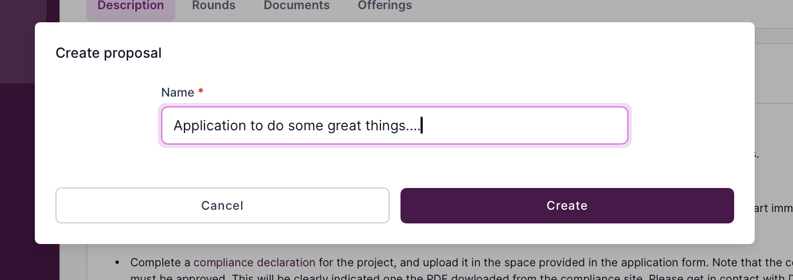{ style="width:100%;max-width:600px;height:auto"}

Click the "Create" button to create your application. This will take you to your application page.

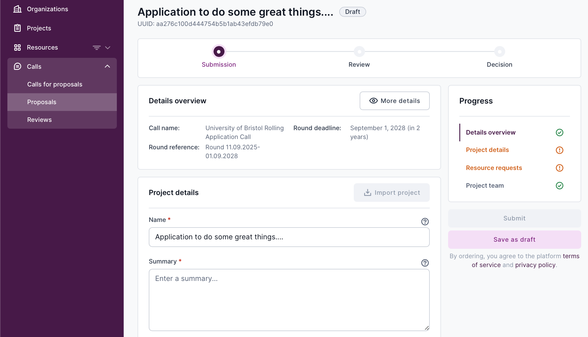{ style="width:100%;max-width:600px;height:auto"}

Fill in the details requested, i.e.

- A project name - this should be a short name that you will use to identify your project
- A project summary - this should be a brief (2-3 paragraph) summary of your project. This will be made visible to other users of BriCS services.
- A project description - this should be a short (3-4 paragraph) description of your project. This does not need to be a full proposal - just a brief description that will help the allocation committee understand what the time on BriCS services will be used for.
- You need to mark whether or not this project is non-commercial or research only. If your project is commercial, you should seek advice from [BriCS support][brics-support].
- You need to mark whether or not the project involves confidential, sensitive or GDPR-protected information. If this is the case, then you should seek advice from [BriCS support][brics-support].

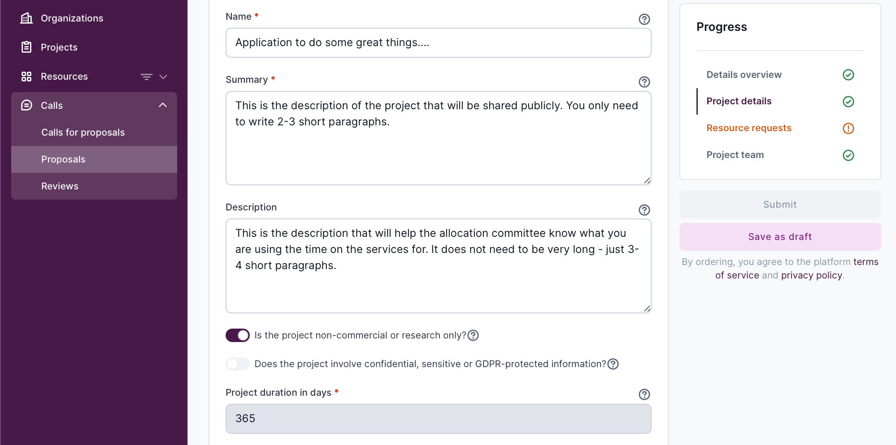{ style="width:100%;max-width:600px;height:auto"}

Note that the project duration is fixed at 365 days. You will be able to apply to extend your project during the its last month if you need more time.

You can click the "Save as draft" button at any time to save your progress.

Next, you need to upload the two forms that you completed earlier:

- A [completed Compliance Assessment form][compliance-assessment]. Navigate to [the link][compliance-assessment], fill in the form, and then download the completed form as a PDF. Follow the instructions in the PDF before continuing. For example, if you see "Please download and save this PDF and upload it with your research application", then you can continue to upload this form with your application. However, if the form asks you to contact your research office, then you need to get in touch with [DREI][contact-drei] to complete a more detailed compliance assessment, which you would then upload with your application.
- A [completed Project Team Information form][project-team-form]. Download the form from [the link][project-team-form], fill in the form, and then upload the completed form with your application.

Do this by clicking on the "Click to upload" button.

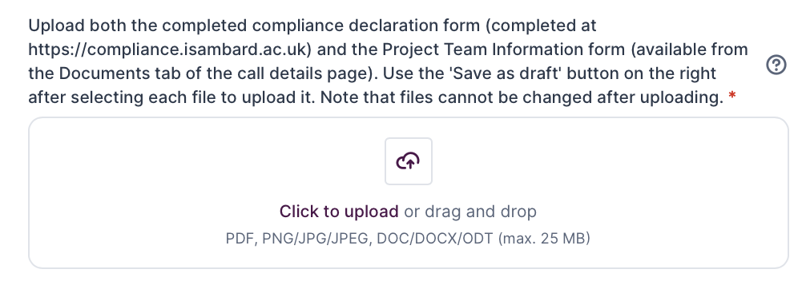{ style="width:100%;max-width:600px;height:auto"}

Click on the "Save as draft" after you have chosen each file to actually upload it with your application.

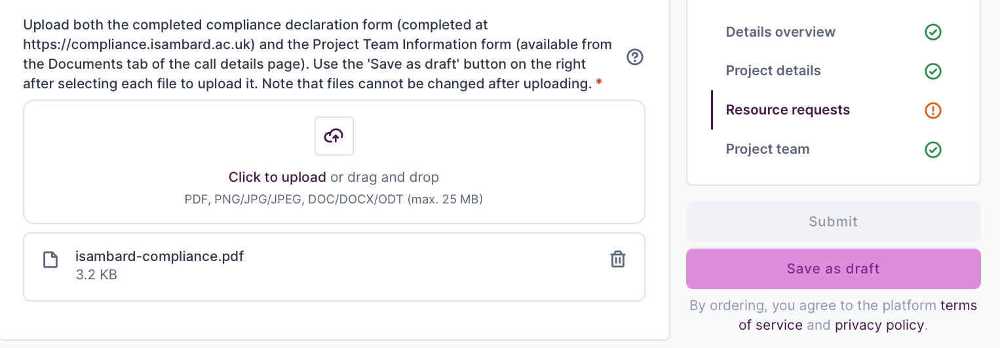{ style="width:100%;max-width:600px;height:auto"}

You will know that the file has been successfully uploaded when you see the icon next to the filename change to a "download" icon.

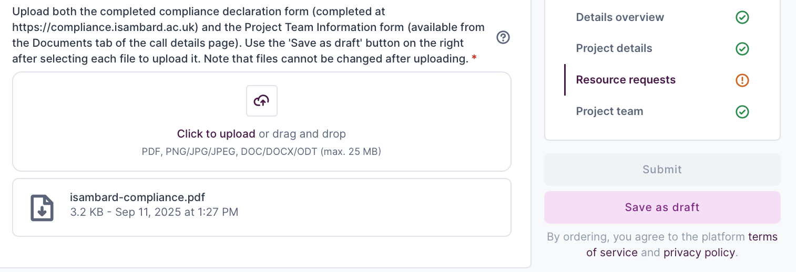{ style="width:100%;max-width:600px;height:auto"}

Note that you cannot remove or change a file after it has been uploaded. If needed, upload a new version of the file, calling it something different (e.g. "isambard-compliance2.pdf").

Make sure that you have uploaded both files before continuing with your application.

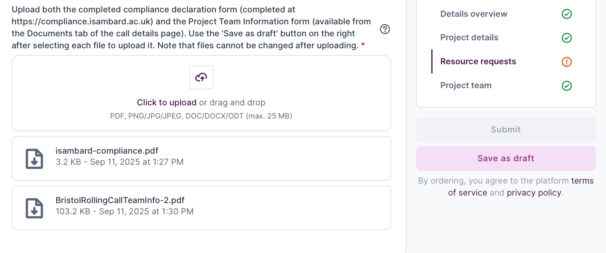{ style="width:100%;max-width:600px;height:auto"}

Next, choose which BriCS services you wish to apply for time on by clicking on the "Add resource" button.

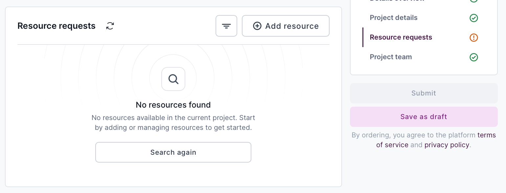{ style="width:100%;max-width:600px;height:auto"}

This will open a dialog box in which you can choose which resource you want to add.

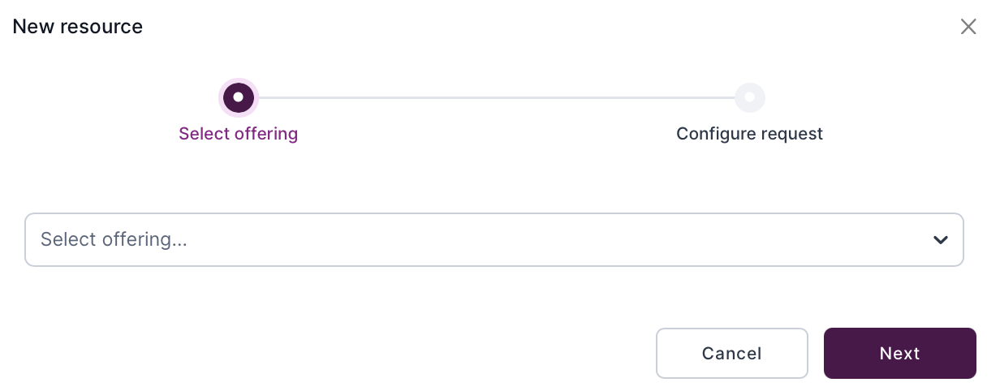{ style="width:100%;max-width:600px;height:auto"}

Choose the service that you wish to add. Note that you can repeat these steps multiple times to add multiple services to your application.

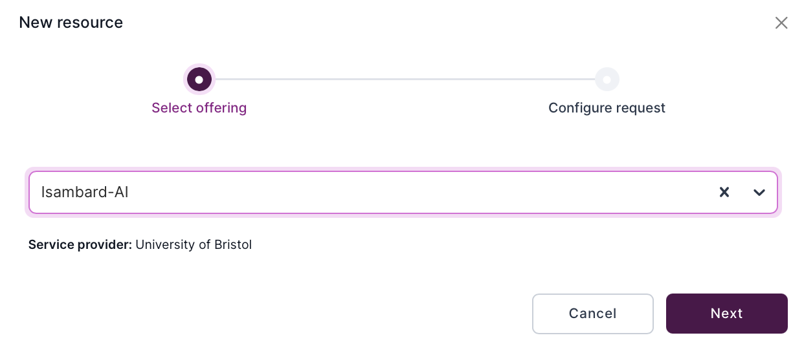{ style="width:100%;max-width:600px;height:auto"}

Click "Next". This will open up a dialog box in which you can configure the request. There is nothing configurable here, as all allocations are for a default number of node hours.

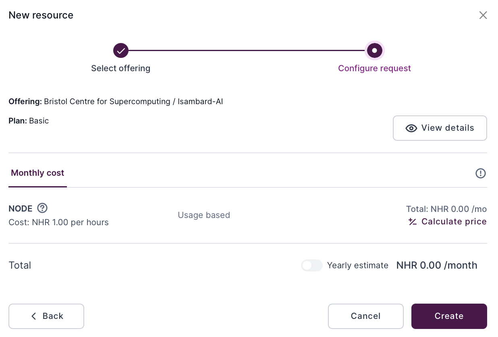{ style="width:100%;max-width:600px;height:auto"}

Click the "Create" button to add the service to your application. Feel free to add as many or few BriCS services to your application as you need.

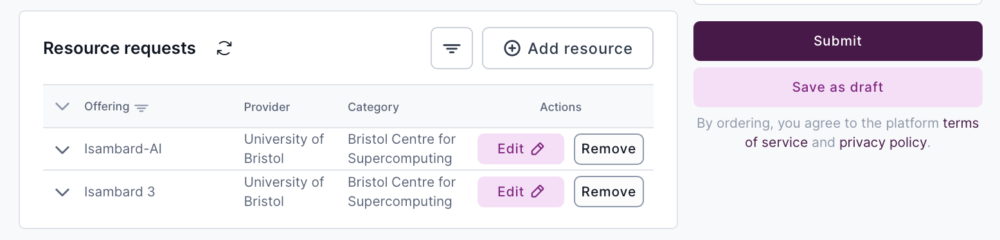{ style="width:100%;max-width:600px;height:auto"}

Now that the form is complete, click the "Submit" button to submit your application.

Note - you should not change any settings in the "Project team" section of the form. This is automatically populated with your details, and only you can submit a form on your behalf.

Note also that you cannot change any details of your application after submission. If you need to change something, please contact [BriCS support][brics-support].

Your application will be assessed by the allocation committee on a rolling basis, in a maximum of one month from submission. If awarded, your project will be created immediately, and you will receive an email inviting you to join the project. This will take you to a project management page, on which you can invite other members of your team to join your project. All members of a team will be able to consume the node hours awarded to your project, but only you, as the project lead, will be able to invite and remove project members.

[uob-rolling-call]: https://allocate.isambard.ac.uk/calls/a597f0c56d6649848cdaee694a2f550c/
[brics-accounting]: https://docs.isambard.ac.uk/user-documentation/guides/accounting/
[brics-support]:  mailto:brics-enquiries@bristol.ac.uk/
[compliance-assessment]: https://compliance.isambard.ac.uk/
[contact-drei]: https://www.bristol.ac.uk/research-enterprise-innovation/
[project-team-form]: https://allocate-api.isambard.ac.uk/api/media/aeac0b7814704777a9b69b39a0db4a8f/
[allocate-isambard]: https://allocate.isambard.ac.uk/
[call-page]: https://allocate.isambard.ac.uk/calls-for-proposals/
