# Apply via time awarded by the University of Bristol

<!--
SPDX-FileCopyrightText: © 2025 University of Bristol
SPDX-License-Identifier: CC-BY-SA-4.0
-->

All University of Bristol staff can apply to be Project Lead (PL) for an Isambard-AI or Isambard 3 research project account. A staff members eligibility to act as PL will be assessed as part of the application review process. 
•	Honorary title holders, visiting academics, and postgraduate and undergraduate students may be added as users on a project account but are not eligible to act as PL. Staff members (e.g. supervisors) may apply for an account in support of a student-led research project, such as a PhD.

!!! warning "You must obtain compliance approval before submitting your application"
    Before submitting your application, you **must** complete a compliance assessment by filling in the [Compliance Assessment form][compliance-assessment]. Compliance approval is **only** obtained if you see, in green, "Please download and save this PDF and upload it with your research application" at the top of the form, e.g.

    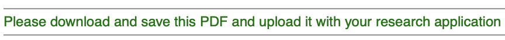{ style="width:100%;max-width:600px;height:auto"}

    If you see any message in red, e.g. asking you to contact your research office, then you **must** email the [Research Compliance Team][contact-drei] to complete a more detailed compliance assessment **before** submitting your application. If compliance is passed, then you must attach to your application a PDF copy of the email you receive from the Research Compliance Team confirming that compliance has been passed.

    In either case, you must [email the Research Compliance Team][contact-drei] a copy of your completed Compliance Assessment form together with details of which application this is, e.g. Isambard AI or 3. All passed compliance applications need to be filed centrally.

## Research use

You can apply for time via the [University of Bristol rolling call][uob-rolling-call]. This is a rolling call. In most cases, applications will be assessed and awarded within a week of submission.

Applications are for a fixed duration of 365 days, and you can apply to extend your project for a further 365 days during its last month if you need more time. Applications are also for default allocations of node hours on the BriCS services requested.

You can apply for additional allocations of node hours once you have consumed more than 90% of your default allocation. Please raise a helpdesk ticket at [support.isambard.ac.uk][helpdesk] if you would like to extend your project or request additional allocations. The expectation is that up to five additional allocations will be granted per year of a project, but this will depend on the availability of resources. Requests for more than five additional allocations will be considered on a case-by-case basis by the [HPC Allocation and Compliance Committee][hacc]. Equally, the expectation is that requests for extension by an additional year will also be granted, subject to the project still being active and work still being conducted by Bristol-based researchers. In most cases, requests for extensions and additional allocations will be assessed and awarded within a week of submission.

Full details of how accounting works on BriCS services are provided in the [BriCS accounting page][brics-accounting].

Currently, the values of the Default and Additional allocations on the different services are:

| Service       | Default allocation | Additional allocation |
|---------------|--------------------|-----------------------|
| Isambard-AI   | 1000 node hours    | 500 node hours        |
| Isambard 3    | 1000 node hours    | 500 node hours        |
| BlueCrystal 5 | 2000 node hours    | 1000 node hours       |

To complete your application, you will need to provide:

- A project name - this should be a short name that you will use to identify your project
- A project summary - this should be a brief (2-3 paragraph) summary of your project. This will be made visible to other users of BriCS services.
- A project description - this should be a short (3-4 paragraph) description of your project. This does not need to be a full proposal - just a brief description that will help the allocation committee understand what the time on BriCS services will be used for.
- You need to check a checkbox to confirm that your project is non-commercial / research only. If your project is commercial, you should seek advice from [BriCS support][brics-support]. Note, projects that are funded by commercial entities, but which are for research use only and conducted by Bristol-based PhD students or PDRAs are considered non-commercial.
- You need to mark whether or not the project involves confidential, sensitive or GDPR-protected information. If this is the case, then you should seek advice from [BriCS support][brics-support].
- You then need to upload two completed forms:
    - A [completed Compliance Assessment form][compliance-assessment]. Navigate to [the link][compliance-assessment], fill in the form, and then download the completed form as a PDF. Follow the instructions in the PDF before continuing. For example, if you see "Please download and save this PDF and upload it with your research application", then you can continue to upload this form with your application. However, **if the form asks you to contact your research office, then you need to get in touch with the [Research Compliance Team][contact-drei] to complete a more detailed compliance assessment, which you would then upload with your application**. Note in any case, you will also need to email the [Research Compliance Team][contact-drei] a copy of your completed Compliance Assessment form together with details of which application this is, e.g. Isambard AI or 3.
    - A [completed Project Team Information form][project-team-form]. Download the form from [the link][project-team-form], fill in the form, and then upload the completed form with your application.

With these details, you can complete your application at [allocate.isambard.ac.uk][allocate-isambard]. More detailed instructions on how to use the allocation system are [provided below](#how-to-complete-your-application).

## Teaching use

More instructions on how to apply for time for teaching will be published soon.

## How to complete your application

Navigate to [allocate.isambard.ac.uk][allocate-isambard] and click "Click here to login".

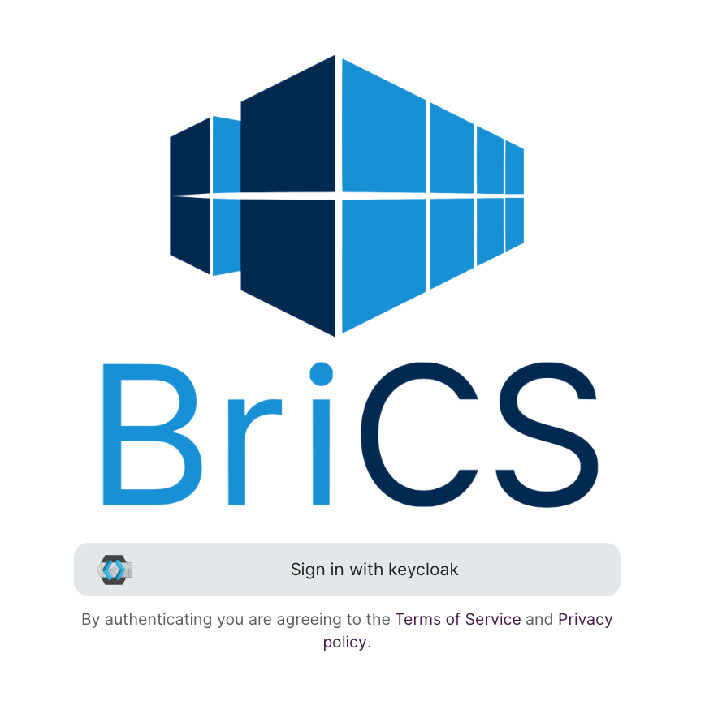{ style="width:100%;max-width:600px;height:auto"}

Next, choose to log in using the "University Login (MyAccessID)" option.

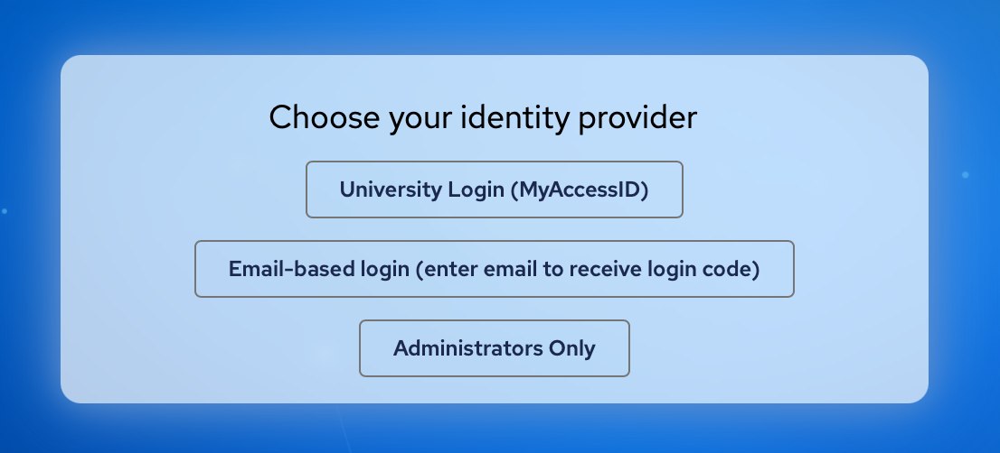{ style="width:100%;max-width:600px;height:auto"}

Type "bristol" in the box, and choose "University of Bristol" as the identity provider.

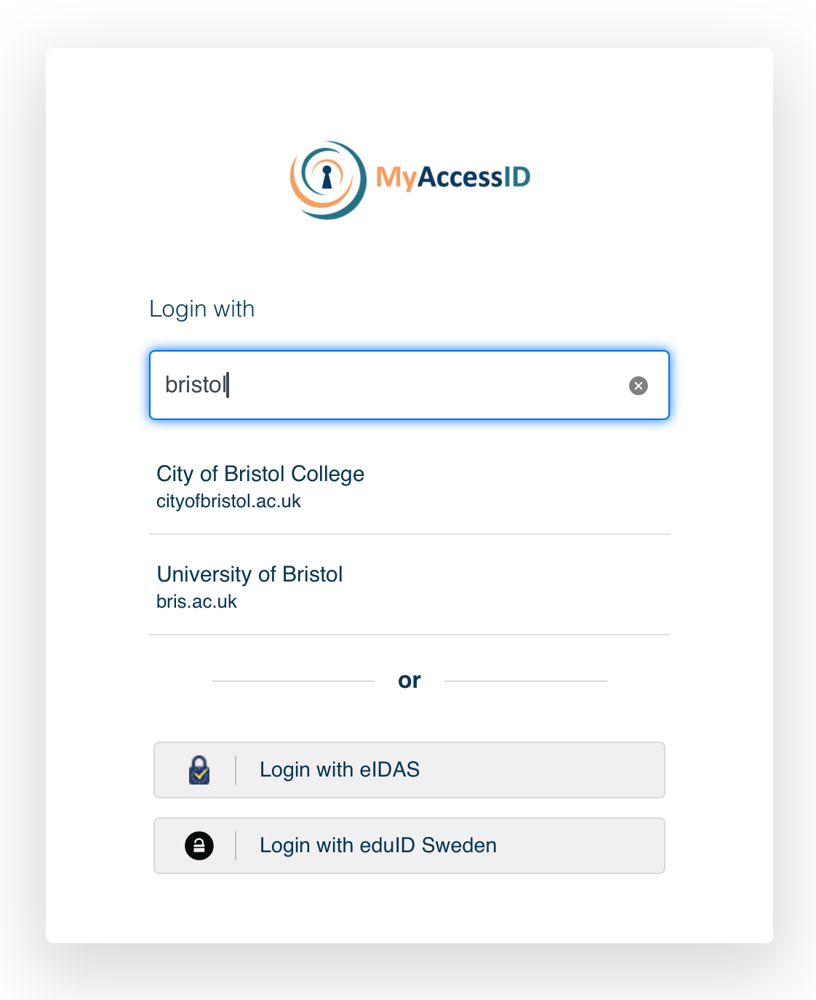{ style="width:100%;max-width:600px;height:auto"}

Log in using your University of Bristol credentials.

Next, go to the [Calls for Proposals][call-page] page.

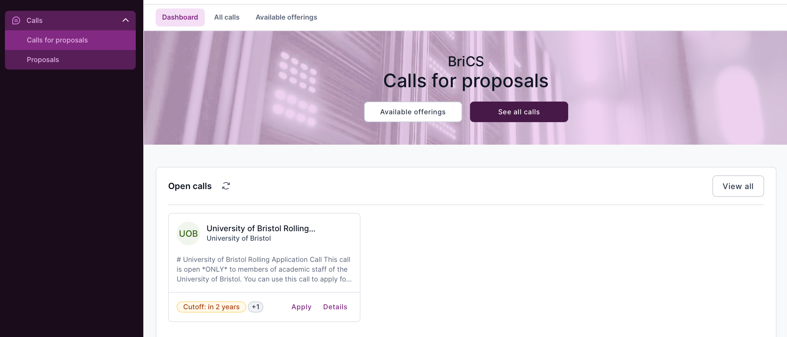{ style="width:100%;max-width:600px;height:auto"}

Click on the call you wish to apply to - for example, the [University of Bristol Rolling Call][uob-rolling-call].

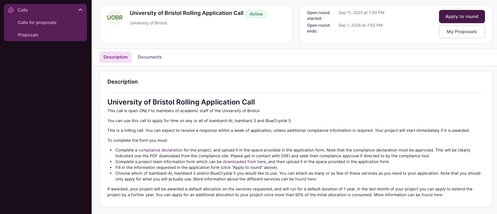{ style="width:100%;max-width:600px;height:auto"}

Click on "Apply to round" when you are ready to apply. This will open up a dialog box in which you can type in the name of your project.

{ style="width:100%;max-width:600px;height:auto"}

Click the "Create" button to create your application. This will take you to your application page.

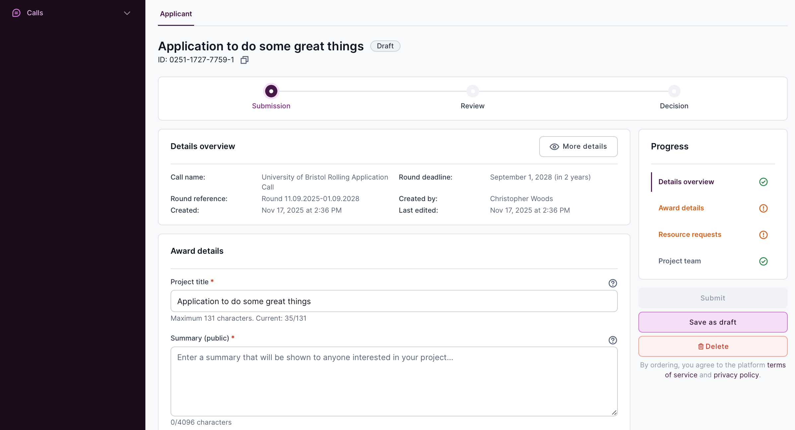{ style="width:100%;max-width:600px;height:auto"}

Fill in the details requested, i.e.

- A project title - this should be a title that you will use to identify your project
- A project summary - this should be a brief (2-3 paragraph) summary of your project. This will be made visible to other users of BriCS services.
- A project description - this should be a short (3-4 paragraph) description of your project. This does not need to be a full proposal - just a brief description that will help the allocation committee understand what the time on BriCS services will be used for.
- You need to check a checkbox to confirm that your project is non-commercial / research only. If your project is commercial, you should seek advice from [BriCS support][brics-support]. Note, projects that are funded by commercial entities, but which are for research use only and conducted by Bristol-based PhD students or PDRAs are considered non-commercial.
- You need to mark whether or not the project involves confidential, sensitive or GDPR-protected information. If this is the case, then you should seek advice from [BriCS support][brics-support].

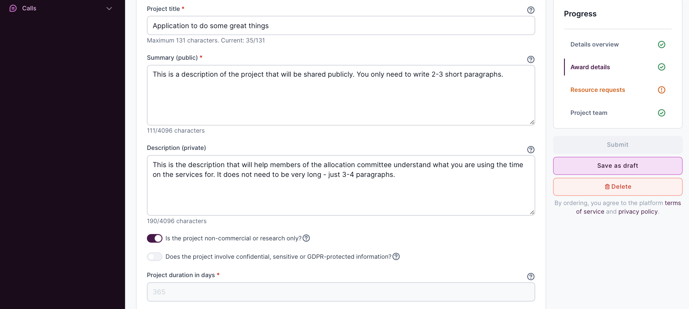{ style="width:100%;max-width:600px;height:auto"}

Note that the project duration is fixed at 365 days. You will be able to apply to extend your project during the its last month if you need more time.

You can click the "Save as draft" button at any time to save your progress, and "Delete" if you want to delete the application and start again.

Next, you need to upload the two forms that you completed earlier:

- A [completed Compliance Assessment form][compliance-assessment]. Navigate to [the link][compliance-assessment], fill in the form, and then download the completed form as a PDF. Follow the instructions in the PDF before continuing. For example, if you see "Please download and save this PDF and upload it with your research application", then you can continue to upload this form with your application. However, **if the form asks you to contact your research office, then you need to get in touch with the [Research Compliance Team][contact-drei] to complete a more detailed compliance assessment, which you would then upload with your application**. Note in any case, you will also need to email the [Research Compliance Team][contact-drei] a copy of your completed Compliance Assessment form together with details of which application this is, e.g. Isambard AI or 3.
- A [completed Project Team Information form][project-team-form]. Download the form from [the link][project-team-form], fill in the form, and then upload the completed form with your application.

Do this by clicking on the "Click to upload" button...

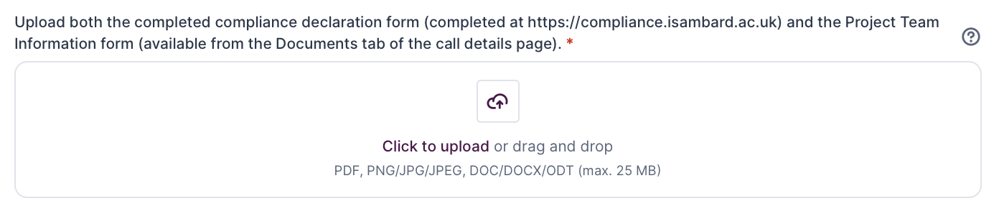{ style="width:100%;max-width:600px;height:auto"}

...and then choosing the file you wish to upload from your computer. It will be uploaded automatically.

The file will be listed once the upload is complete.

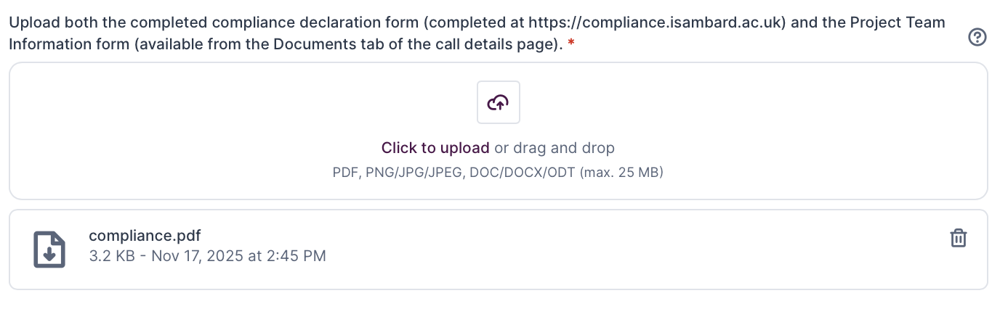{ style="width:100%;max-width:600px;height:auto"}

Note that you can delete the file by clicking on the trash can icon next to the file name.

Make sure that you have uploaded both files before continuing with your application.

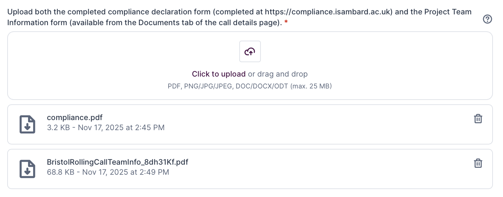{ style="width:100%;max-width:600px;height:auto"}

Next, choose which BriCS service(s) you wish to use by checking the relevant boxes in the "Resources" section of the form.

{ style="width:100%;max-width:600px;height:auto"}

Then click the "Save" button to save your choice.

Now - optionally - you can provide further information about who you want to add to your project by completing the "Project team" section.

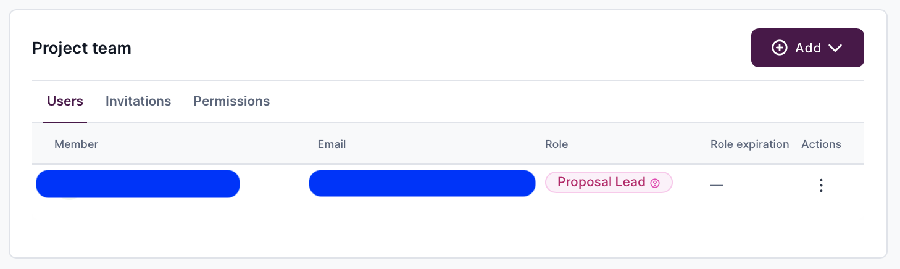{ style="width:100%;max-width:600px;height:auto"}

You will be listed as the "Proposal Lead" automatically, and cannot remove yourself from this role. However, you can add other team members in any of the following roles:

1. Proposal Lead - this is someone who has full power over the proposal, and will also have full power over any project that is awarded if this proposal is successful. They can edit everything, can invite other people in any role, and can also submit the proposal. If awarded, they will become a "Project Lead" or "PI" on the project.

2. Proposal Co-Lead - this is someone can see the proposal but cannot edit it. They will be invited onto any project that is awarded if this proposal is successful. They will join the project as a "Project Co-Lead" or "Co-I".

3. Proposal Member - this is a member of the proposal, i.e. representing researchers who will be working on the project if it is awarded. They can see the proposal but cannot edit it. They will be invited onto any project that is awarded if this proposal is successful. They will join the project as a "Project Member" or "Researcher".

To add a team member, click the "Add" drop-down and choose either to invite a team member by email, or to directly add the team member.

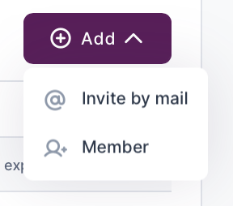{ style="width:100%;max-width:600px;height:auto"}

The easiest route is to use the "Add member" option. This will open this dialog box:

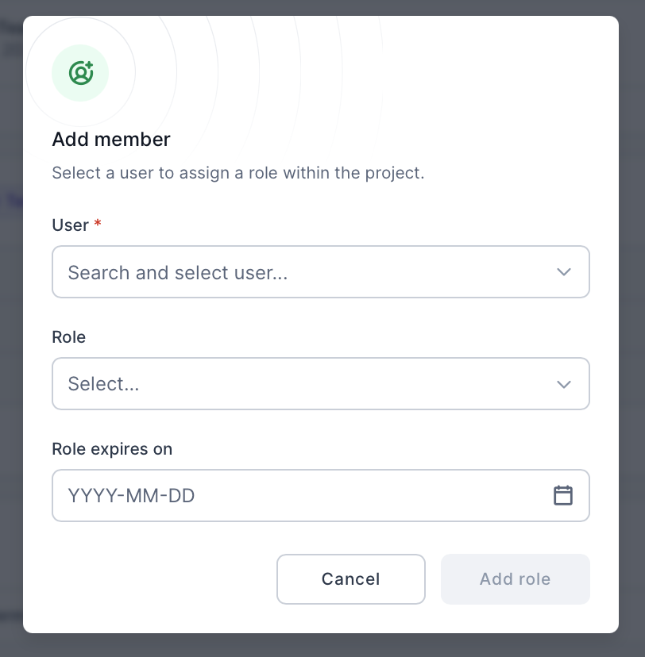{ style="width:100%;max-width:600px;height:auto"}

Click the "User" box and then click on "+ Create User".

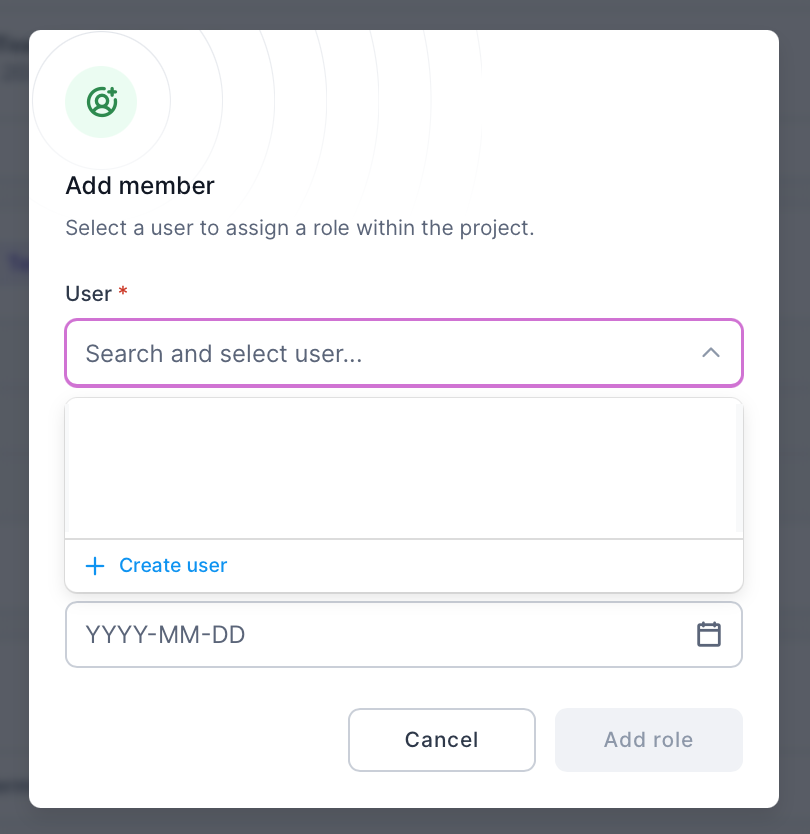{ style="width:100%;max-width:600px;height:auto"}

This will open another dialog box into which you can add the invitee's details (email, first name and last name).

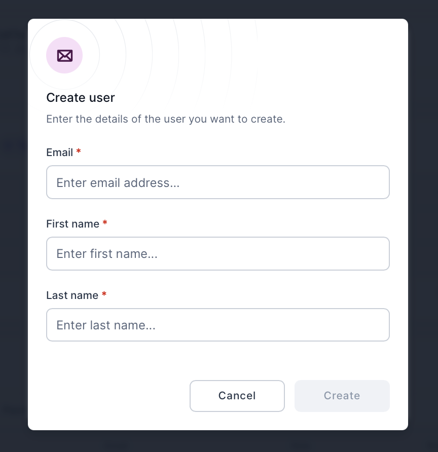{ style="width:100%;max-width:600px;height:auto"}

Click "Create" to create the user. You will then be taken back to the previous dialog box, with this new user selected. You can now choose their role in the project from the "Role" drop-down.

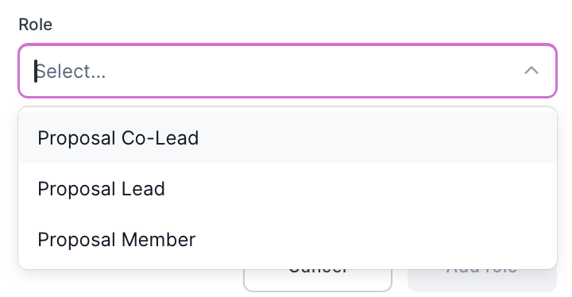{ style="width:100%;max-width:600px;height:auto"}

Click "Add role" once you have selected the role. The user will now be added to the project team.

Now that the form is complete, click the "Submit" button to submit your application.

You should receive an email confirming that your application has been submitted successfully.

Your application will be assessed by the [HPC Allocation and Compliance Committee][hacc] on a rolling basis.

You will receive an email when a decision has been made on your application. This could include returning your application to you if further information is required. In this case, complete the necessary changes and re-submit your application.

Assessment of your application will normally be within one week of project submission. If awarded, your project will be created immediately, and you (and all of your project team) will receive email(s) inviting you to join the project. This will take you to a project management page, on which you can invite further members of your team to join your project if you wish. All members of a team will be able to consume the node hours awarded to your project, but only you, as the project lead, will be able to invite and remove project members.

Note that one project per resource requested will be created. For example, if you requested time on both Isambard AI and BlueCrystal 5, then two separate projects will be created - one on each resource. You will be the project lead on both projects, and all of your project team will be invited to join both projects. You will all have to accept the invitations to join each project before you can access the resources.

Please contact [BriCS support][brics-support] if you have any questions about this process.

[uob-rolling-call]: https://allocate.isambard.ac.uk/calls/a597f0c56d6649848cdaee694a2f550c/
[brics-accounting]: https://docs.isambard.ac.uk/user-documentation/guides/accounting/
[brics-support]:  mailto:brics-support@bristol.ac.uk/
[helpdesk]: https://support.isambard.ac.uk/
[compliance-assessment]: https://compliance.isambard.ac.uk/
[contact-drei]: mailto:research-compliance@bristol.ac.uk
[project-team-form]: https://allocate-api.isambard.ac.uk/api/media/e9a00e43dbbe486aab2c172d52ff1e79/
[allocate-isambard]: https://allocate.isambard.ac.uk/
[call-page]: https://allocate.isambard.ac.uk/calls-for-proposals/
[hacc]: https://uob.sharepoint.com/sites/dri/SitePages/HACC.aspx
