# Apply for University of Bristol access

<!--
SPDX-FileCopyrightText: © 2025 University of Bristol
SPDX-License-Identifier: CC-BY-SA-4.0
-->

### Open a research project account on Isambard-AI, Isambard 3 or BlueCrystal 5

Eligibility criteria 

**Isambard-AI and Isambard 3**: Most University of Bristol staff are eligible to act as Project Lead (PL) for an Isambard-AI or Isambard 3 research project. 

- Research fellows employed by the University are eligible to be PL. Non-employed fellows cannot act as PL.
  
- Postdoctoral researchers are eligible to be Co-Lead (CL) but not PL.  
  
- Honorary title holders, visiting academics, and postgraduate and undergraduate students can be added as users of a research project account but are not eligible to be a PL or CL. Staff members (e.g. supervisors) may apply on behalf of a student-led project, such as a PhD.
  
An applicant's eligibility to be Project Lead or Co-Lead is checked as part of the account application review.

**BlueCrystal 5**: The environment is open to a small number of Schools. You can apply for an account if your School has access and you meet the general PL eligibility criteria.  
 
## Important information before you apply 

- Research project accounts have a 1-year duration but can renewed for a further year during the final month of the account, if required. [Request account renewal](https://forms.cloud.microsoft/e/Wp5SgwLpQx). Renewal requests are typically granted within a few days.  
- You can open a research project account for any type of research activity, including exploratory research, idea testing and post graduate research projects.
- One project account per research activity: Your project account **must only** be used for the research activities listed in your application. If, at a later stage, you wish to undertake additional research that falls outside the approved scope, you must apply for a separate project account so these activities can be reviewed by Research Compliance.

**Node hours allocations for research projects**

- New research project accounts receive an initial Default node hours (NHR) allocation on the BriCS services requested, and can request additional NHR if required (see below).

Project Leads or Co-Leads can: 

- [Request a 1,000 NHR Top-up](https://forms.cloud.microsoft/e/Wp5SgwLpQx), valid for the duration of the project (max 3 requests per project, per year), or

- [Request a One-off NHR allocation](https://forms.cloud.microsoft/e/Wp5SgwLpQx), valid for 1 month. You can request further One-off allocations once you've used your node hours or they've expired. One-off NHR are allocated on a first come, first served basis, when spare compute is available on the requested environment.

| Service       | Default allocation | Top-up allocation | One-off allocation |
|---------------|--------------------|-------------------|--------------------|
| Isambard-AI   | 1,000 NHR   | 3 x 1,000 NHR | Up to 5,000 NHR    |
| Isambard 3    | 1,000 NHR   | 3 x 1,000 NHR | Up to 5,000 NHR    |
| BlueCrystal 5 | 2,000 NHR   | 3 x 1,000 NHR | Up to 10,000 NHR   |

Full details of how node hours accounting works on BriCS services are provided in the [BriCS accounting page][brics-accounting].

## Apply now
### Step 1: 

!!! warning "You must obtain compliance approval before submitting your application"
    
    - If you are requesting access to Isambard-AI or Isambard 3, complete the **[Compliance Assessment form][compliance-assessment]**. 
    - If you are requesting access to BlueCrystal 5, complete the University of Bristol [Research Project Compliance Tool](https://apps.powerapps.com/play/e/default-b2e47f30-cd7d-4a4e-a5da-b18cf1a4151b/a/945bbb5c-02b5-4605-a597-a108a8a432d3?tenantId=b2e47f30-cd7d-4a4e-a5da-b18cf1a4151b&source=sharebutton&sourcetime=1773318140178). 

    

**What you need to know about research compliance approval**

- **Multiple environments:** If you are requesting access to BlueCrystal 5 and one or both of the Isambard-AI and Isambard 3 environments, you must complete both the [Isambards Compliance Assessment form][compliance-assessment] and the University of Bristol  [Research Project Compliance Tool](https://apps.powerapps.com/play/e/default-b2e47f30-cd7d-4a4e-a5da-b18cf1a4151b/a/945bbb5c-02b5-4605-a597-a108a8a432d3?tenantId=b2e47f30-cd7d-4a4e-a5da-b18cf1a4151b&source=sharebutton&sourcetime=1773318140178).
- **Green message**: If your Isambards Compliance Report shows a green message at the top of the first page stating "Please download and save this PDF and upload it with your research application," your project has passed the compliance assessment. Upload the PDF with your application - no further action is needed.
- **Red message**: If your Isambards Compliance Report shows a red message asking you to contact your research office, email the [Research Compliance Team][contact-drei] to request a detailed assessment. Once your project is approved, attach a PDF of your compliance approval to your BriCS research project application alongside your original Isambards Compliance Report.
    
### Step 2: 

**NB**: Alongside the relevant compliance forms, you need to attach this forms to your application before submitting:

- The [Project Team Information form][project-team-form]

### Step 3: 

**Applying for a research project account**

Applications for a research project account on Isambard-AI, Isambard 3 or BlueCrystal 5 are made via the [University of Bristol rolling call][uob-rolling-call]. New research accounts are typically set up within one week.  

### Information you need to provide when applying for an account

- Project name: a short name for your research project
- Project summary: a brief (2–3 paragraph) overview of your project, written for a general audience. This will be visible to other BriCS users.
- Project description: 3–4 paragraphs outlining the specific research you'll undertake using BriCS's advanced compute resources. 
- You need to check a checkbox to confirm that your project is non-commercial / research only. If your project is commercial, you should seek advice from the [HPC Allocation and Compliance Committee][hacc-email]. 
- Information classification: You'll need to state whether your project involves confidential, sensitive or GDPR-protected information. If this is the case, please seek advice from [BriCS support][brics-support] before submitting your application.

### Step 4: 

## Complete your application now

Navigate to [allocate.isambard.ac.uk][allocate-isambard] and click "Click here to login".

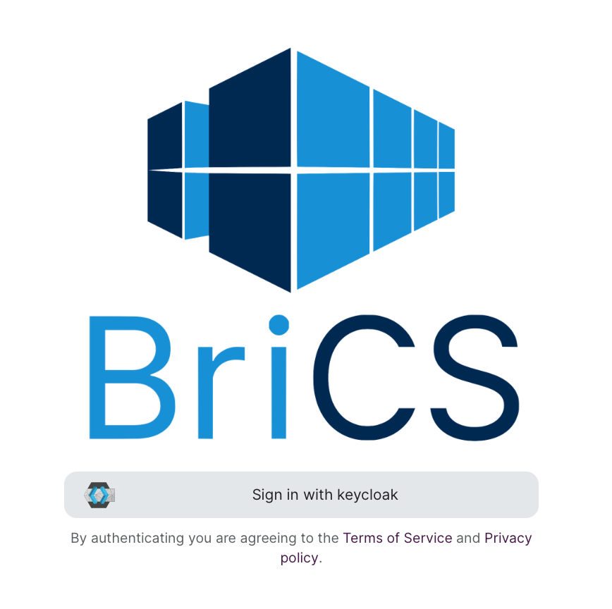{ style="width:100%;max-width:600px;height:auto"}

Next, choose to log in using the "University Login (MyAccessID)" option.

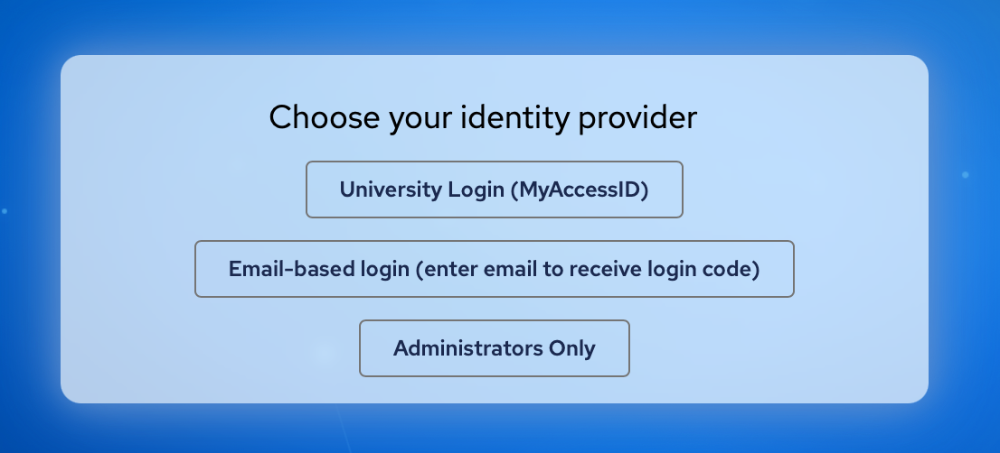{ style="width:100%;max-width:600px;height:auto"}

Type "bristol" in the box, and choose "University of Bristol" as the identity provider.

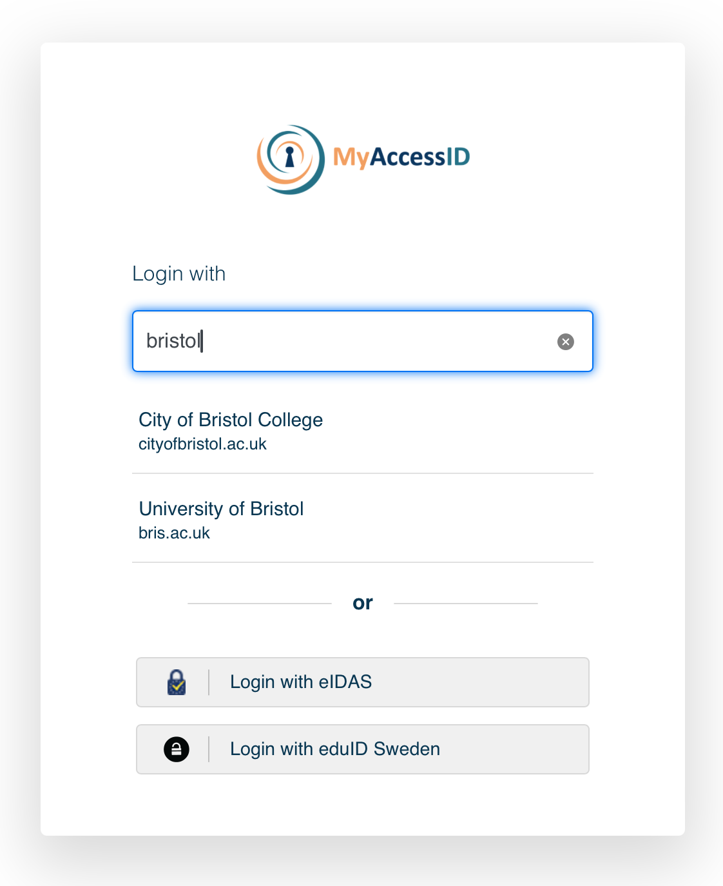{ style="width:100%;max-width:600px;height:auto"}

Log in using your University of Bristol credentials.

Next, go to the [Calls for Proposals][call-page] page.

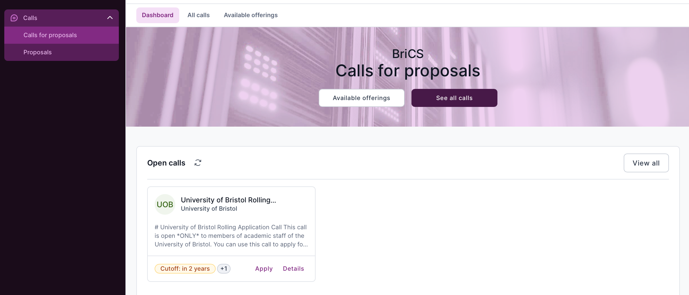{ style="width:100%;max-width:600px;height:auto"}

Click on the call you wish to apply to - for example, the [University of Bristol Rolling Call][uob-rolling-call].

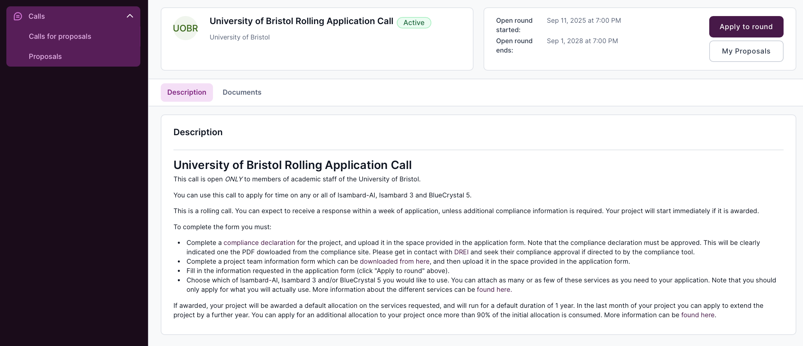{ style="width:100%;max-width:600px;height:auto"}

Click on "Apply to round" when you are ready to apply. This will open up a dialog box in which you can type in the name of your project.

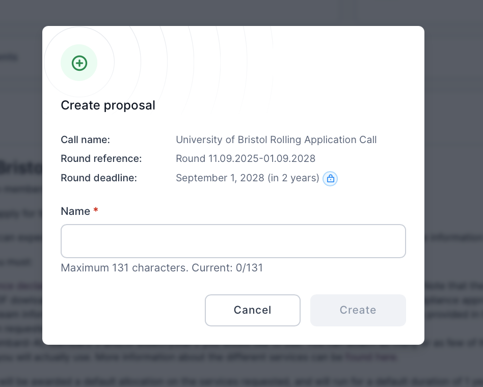{ style="width:100%;max-width:600px;height:auto"}

Click the "Create" button to create your application. This will take you to your application page.

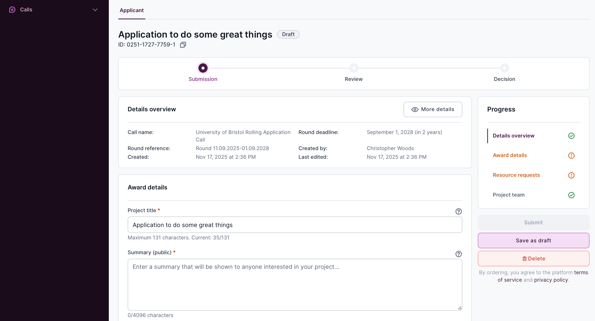{ style="width:100%;max-width:600px;height:auto"}

Fill in the details requested, i.e.

- A project title - this should be a title that you will use to identify your project
- A project summary - this should be a brief (2-3 paragraph) summary of your project. This will be made visible to other users of BriCS services.
- A project description - this should be a short (3-4 paragraph) description of your project. This does not need to be a full proposal - just a brief description that will help the allocation committee understand what the time on BriCS services will be used for.
- You need to check a checkbox to confirm that your project is non-commercial / research only. If your project is commercial, you should seek advice from the [HPC Allocation and Compliance Committee][hacc-email]. Note, projects that are funded by commercial entities, but which are for research use only and conducted by Bristol-based PhD students or PDRAs are considered non-commercial.
- You need to mark whether or not the project involves confidential, sensitive or GDPR-protected information. If this is the case, then you should seek advice from [BriCS support][brics-support].

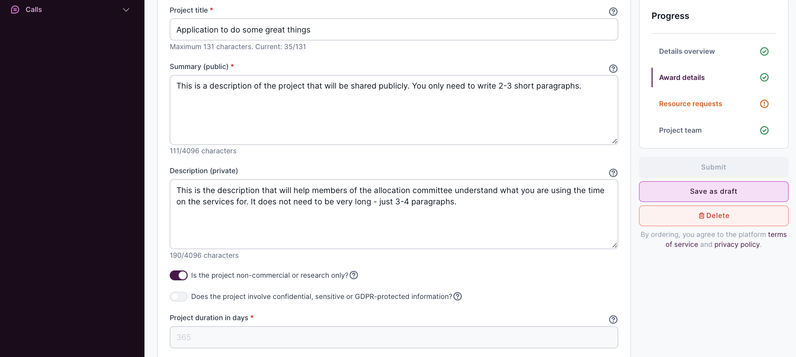{ style="width:100%;max-width:600px;height:auto"}

Note that the project duration is fixed at 365 days. You will be able to apply to extend your project during the its last month if you need more time.

You can click the "Save as draft" button at any time to save your progress, and "Delete" if you want to delete the application and start again.

Next, you need to upload the two forms that you completed earlier:

- A [completed Compliance Assessment form][compliance-assessment]. Navigate to [the link][compliance-assessment], fill in the form, and then download the completed form as a PDF. Follow the instructions in the PDF before continuing. For example, if you see "Please download and save this PDF and upload it with your research application", then you can continue to upload this form with your application. However, **if the form asks you to contact your research office, then you need to get in touch with the [Research Compliance Team][contact-drei] to complete a more detailed compliance assessment, which you would then upload with your application**. Note in any case, you will also need to email the [Research Compliance Team][contact-drei] a copy of your completed Compliance Assessment form together with details of which application this is, e.g. Isambard AI or 3.
- A [completed Project Team Information form][project-team-form]. Download the form from [the link][project-team-form], fill in the form, and then upload the completed form with your application.

Do this by clicking on the "Click to upload" button...

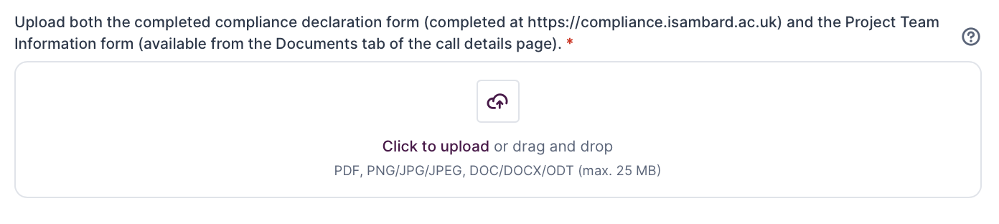{ style="width:100%;max-width:600px;height:auto"}

...and then choosing the file you wish to upload from your computer. It will be uploaded automatically.

The file will be listed once the upload is complete.

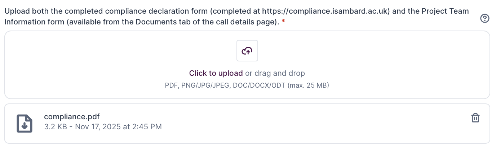{ style="width:100%;max-width:600px;height:auto"}

Note that you can delete the file by clicking on the trash can icon next to the file name.

Make sure that you have uploaded both files before continuing with your application.

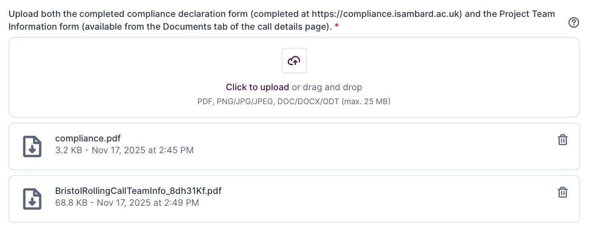{ style="width:100%;max-width:600px;height:auto"}

Next, choose which BriCS service(s) you wish to use by checking the relevant boxes in the "Resources" section of the form.

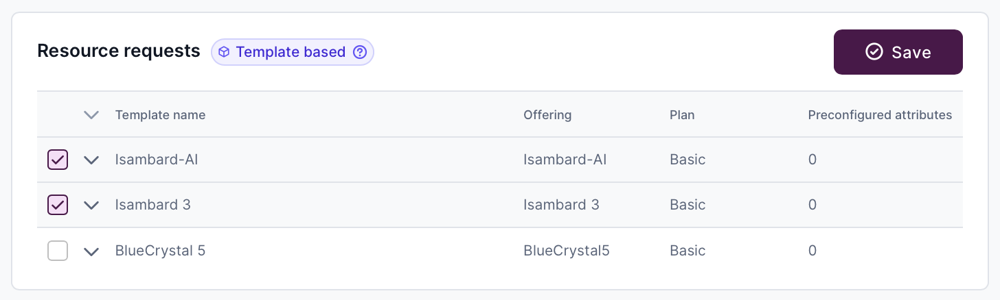{ style="width:100%;max-width:600px;height:auto"}

Then click the "Save" button to save your choice.

Now - optionally - you can provide further information about who you want to add to your project by completing the "Project team" section.

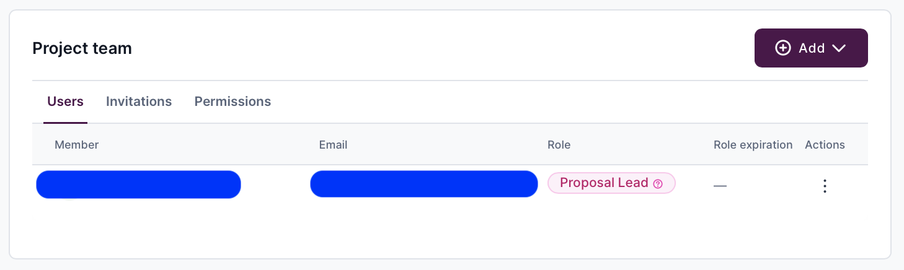{ style="width:100%;max-width:600px;height:auto"}

You will be listed as the "Proposal Lead" automatically, and cannot remove yourself from this role. However, you can add other team members in any of the following roles:

1. Proposal Lead - this is someone who has full power over the proposal, and will also have full power over any project that is awarded if this proposal is successful. They can edit everything, can invite other people in any role, and can also submit the proposal. If awarded, they will become a "Project Lead" or "PI" on the project.

2. Proposal Co-Lead - this is someone can see the proposal but cannot edit it. They will be invited onto any project that is awarded if this proposal is successful. They will join the project as a "Project Co-Lead" or "Co-I".

3. Proposal Member - this is a member of the proposal, i.e. representing researchers who will be working on the project if it is awarded. They can see the proposal but cannot edit it. They will be invited onto any project that is awarded if this proposal is successful. They will join the project as a "Project Member" or "Researcher".

To add a team member, click the "Add" drop-down and choose either to invite a team member by email, or to directly add the team member.

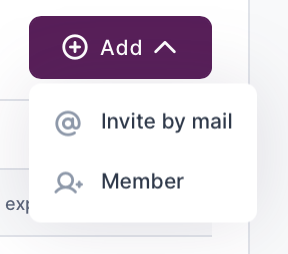{ style="width:100%;max-width:600px;height:auto"}

The easiest route is to use the "Add member" option. This will open this dialog box:

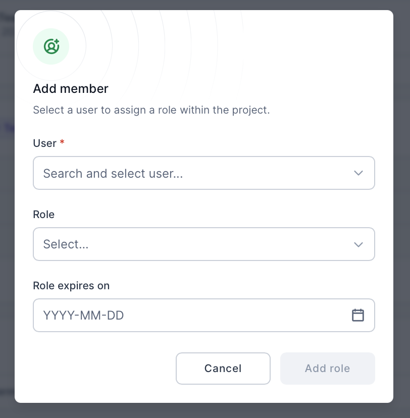{ style="width:100%;max-width:600px;height:auto"}

Click the "User" box and then click on "+ Create User".

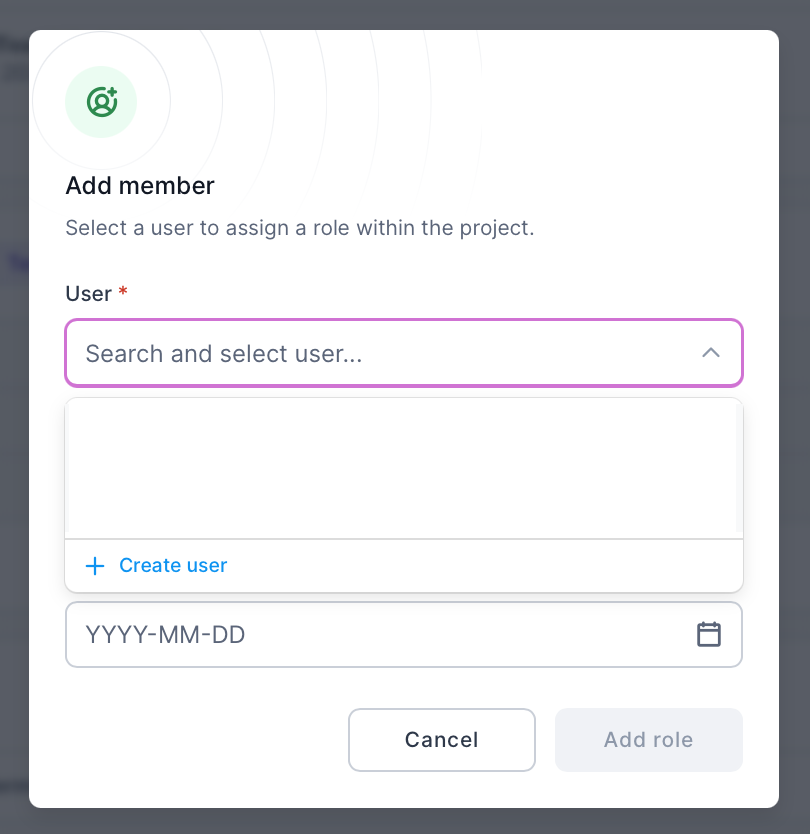{ style="width:100%;max-width:600px;height:auto"}

This will open another dialog box into which you can add the invitee's details (email, first name and last name).

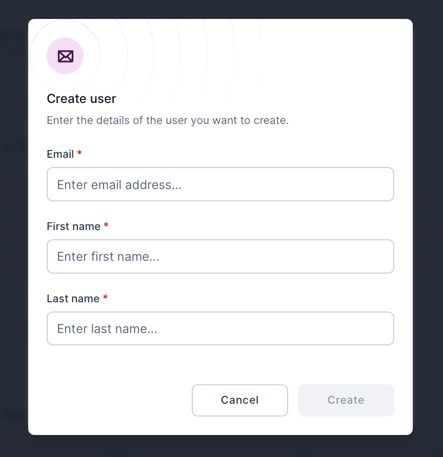{ style="width:100%;max-width:600px;height:auto"}

Click "Create" to create the user. You will then be taken back to the previous dialog box, with this new user selected. You can now choose their role in the project from the "Role" drop-down.

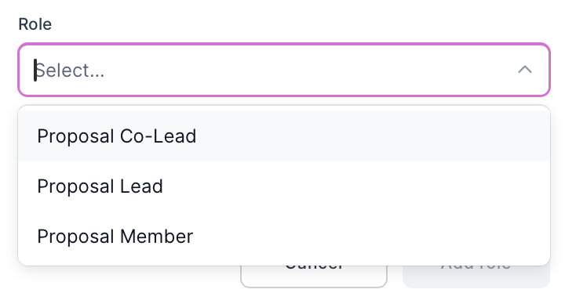{ style="width:100%;max-width:600px;height:auto"}

Click "Add role" once you have selected the role. The user will now be added to the project team.

Now that the form is complete, click the "Submit" button to submit your application.

You should receive an email confirming that your application has been submitted successfully.

Your application will be assessed by the [HPC Allocation and Compliance Committee][hacc] on a rolling basis.

You will receive an email when a decision has been made on your application. This could include returning your application to you if further information is required. In this case, complete the necessary changes and re-submit your application.

Assessment of your application will normally be within one week of project submission. If awarded, your project will be created immediately, and you (and all of your project team) will receive email(s) inviting you to join the project. This will take you to a project management page, on which you can invite further members of your team to join your project if you wish. All members of a team will be able to consume the node hours awarded to your project, but only you, as the project lead, will be able to invite and remove project members.

Note that one project per resource requested will be created. For example, if you requested time on both Isambard AI and BlueCrystal 5, then two separate projects will be created - one on each resource. You will be the project lead on both projects, and all of your project team will be invited to join both projects. You will all have to accept the invitations to join each project before you can access the resources.

Please contact the [HPC Allocation and Compliance Committee][hacc-email] if you have any questions about this process.

[uob-rolling-call]: https://allocate.isambard.ac.uk/calls/a597f0c56d6649848cdaee694a2f550c/
[brics-accounting]: https://docs.isambard.ac.uk/user-documentation/guides/accounting/
[brics-support]:  mailto:brics-support@bristol.ac.uk/
[helpdesk]: https://support.isambard.ac.uk/
[compliance-assessment]: https://compliance.isambard.ac.uk/
[contact-drei]: mailto:research-compliance@bristol.ac.uk
[project-team-form]: https://allocate-api.isambard.ac.uk/api/media/e9a00e43dbbe486aab2c172d52ff1e79/
[allocate-isambard]: https://allocate.isambard.ac.uk/
[call-page]: https://allocate.isambard.ac.uk/calls-for-proposals/
[hacc]: https://uob.sharepoint.com/sites/dri/SitePages/HACC.aspx
[hacc-email]: mailto:hacc-committee@bristol.ac.uk
