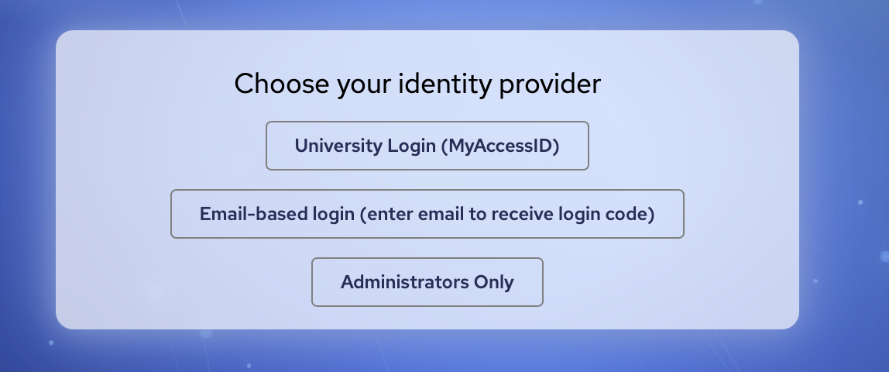
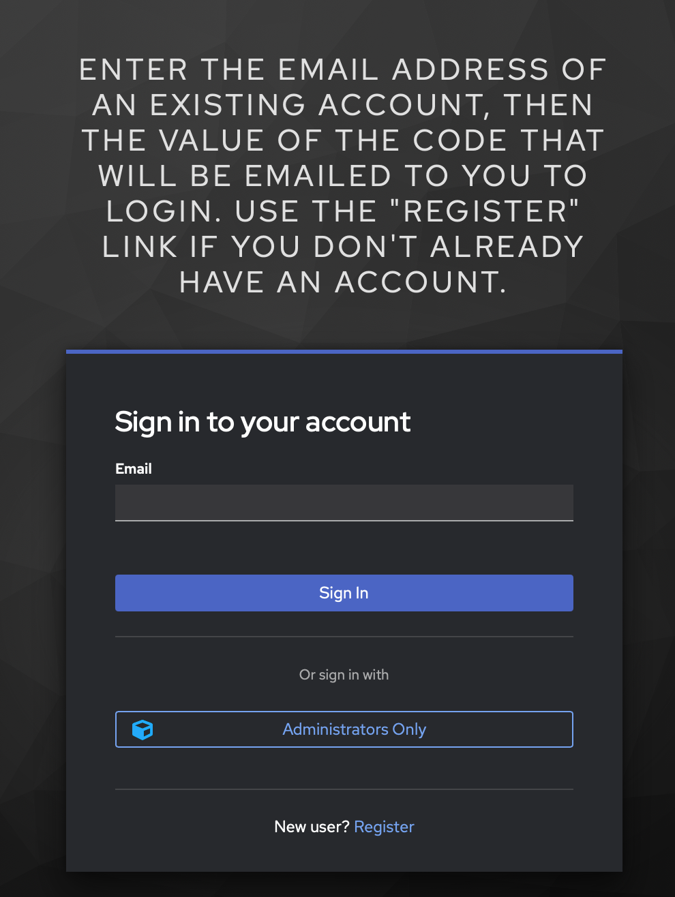
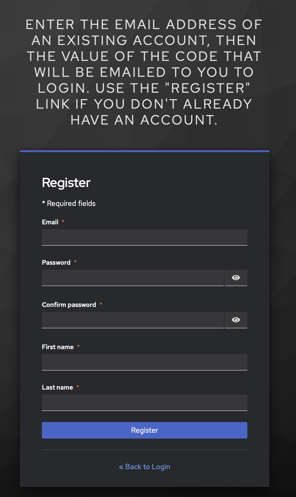
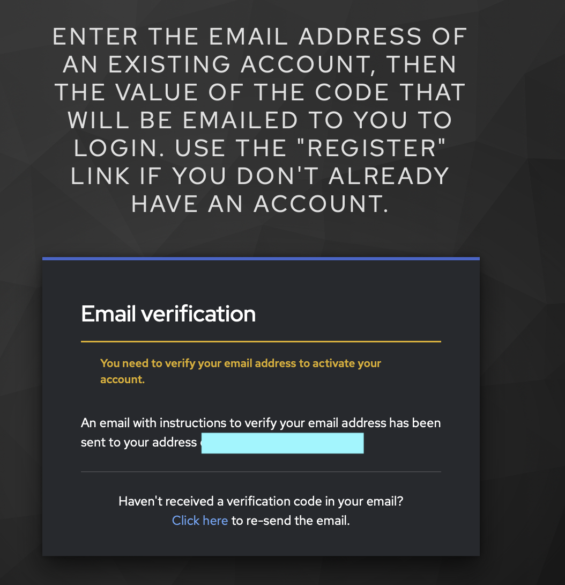
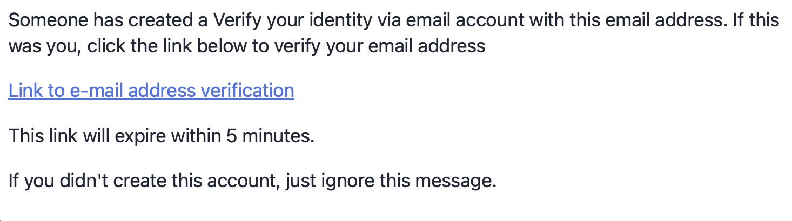
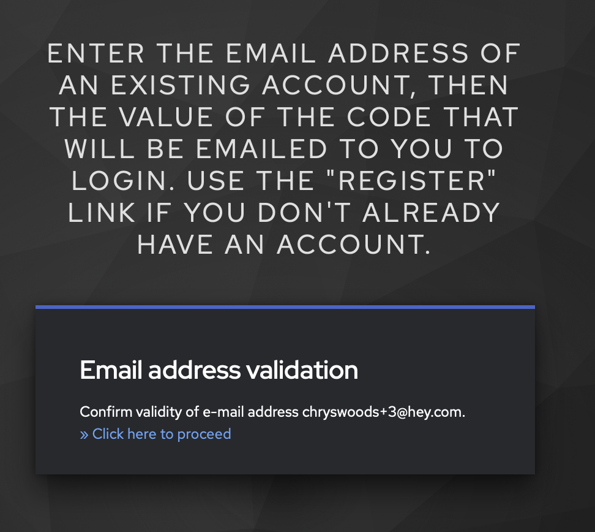
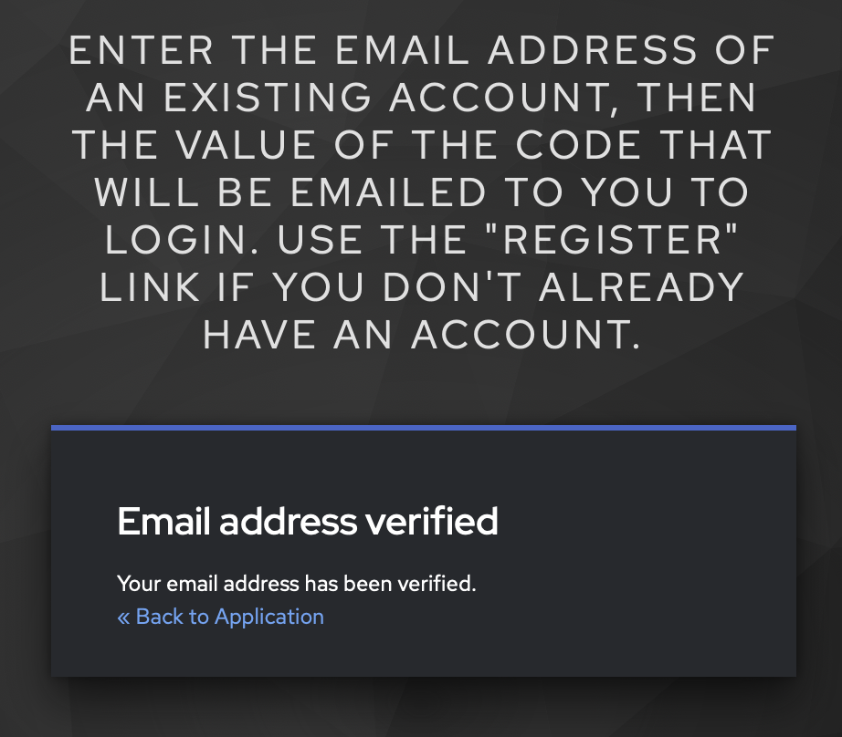
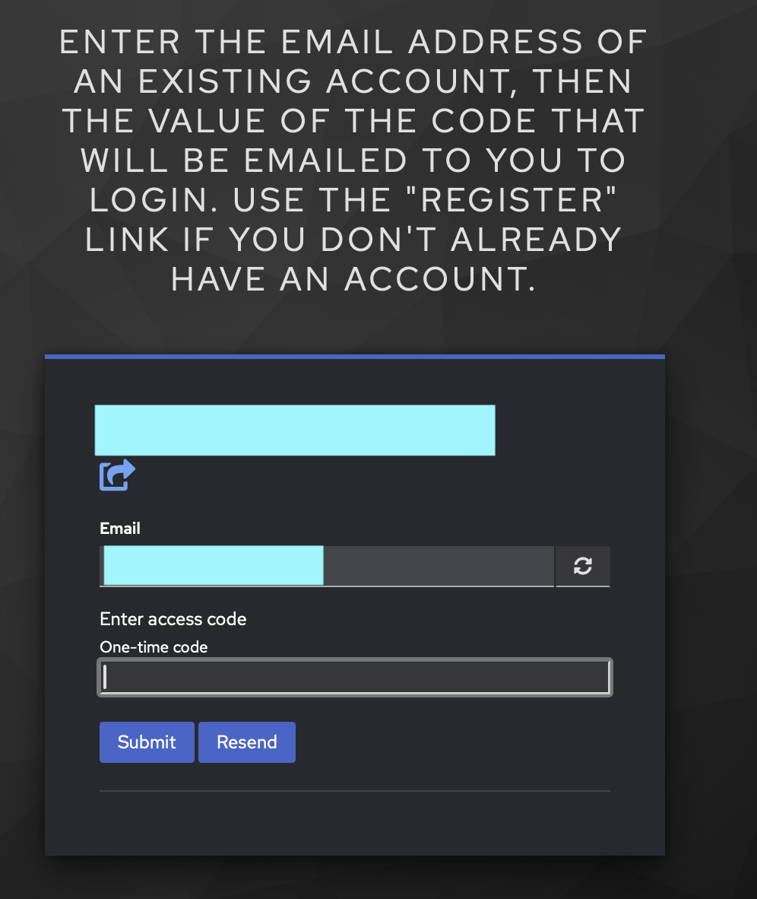
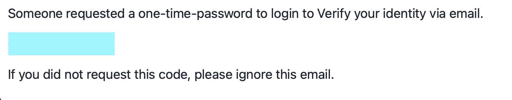

# Logging in using the Email Authenticator

<!--
SPDX-FileCopyrightText: © 2026 University of Bristol
SPDX-License-Identifier: CC-BY-SA-4.0
-->

The Email Authenticator is a simple authentication method that allows you to
log in using your professional email address (i.e. the one issued by your
institution or employer).

To log in using this route, choose the "Email based login (enter email to receive login code)
option on the "Choose your identity provider" screen.

{ style="width:100%;max-width:600px;height:auto"}

## Registering a new account

If this is your first time using the Email Authenticator, then you will need to
register a new account. Do this by clicking the "New user? Register" link at
the bottom of the page.

{ style="width:100%;max-width:600px;height:auto}

Enter the details requested on that page, e.g. your professional email address,
a chosen password (twice), and your first and last name. Then click the
"Register" button.

{ style="width:100%;max-width:600px;height:auto}

You will see a screen saying that you need to verify your email address. It lets
you know that an email has been sent to the address you provided.

{ style="width:100%;max-width:600px;height:auto}

You should receive an email with the subject "Verify email". The contents will look
something like this:

{ style="width:100%;max-width:600px;height:auto}

Click on the link in the email ("Link to e-mail address verification") to
verify your email address. Note that you must do this within 5 minutes of
registering, otherwise the link will expire and you will need to start the
registration process again.

Opening the link will open this page:

{ style="width:100%;max-width:600px;height:auto}

This page shows you the email address that you want to verify - ensure that this
matches the email address you entered when registering. If it does, click the
link "Click here to proceed".

This will open this page:

{ style="width:100%;max-width:600px;height:auto}

Now you have registered your account, you can now move to the "Logging in" section below.

Note that you will need to navigate back to the "Choose your identity provider" screen and select the "Email based login (enter email to receive login code) option again to log in.

## Logging in

To log in using the Email Authenticator, choose the "Email based login (enter email to receive login code) option on the "Choose your identity provider" screen.

{ style="width:100%;max-width:600px;height:auto}

In the "Email based login" page, enter your professional email address (the one you used to register) and click the "Sign in" button.

{ style="width:100%;max-width:600px;height:auto}

This will send you an email code to your email address and will open the below page:

{ style="width:100%;max-width:600px;height:auto}

Look for an email with the subject that is something like "Your access code for Verify your identity via email". The contents will look something like this:

{ style="width:100%;max-width:600px;height:auto}

Type the code into the "One-time code" box in the login page above, and then
click "Submit". Use the "Resend" button if you do not receive the email within 5 minutes.

Note that the code is only valid for 5 minutes, so you must enter it within that time frame. If you do not, you will need to start the login process again.

Once you have entered the code successfully, you will be logged into your desired application.
